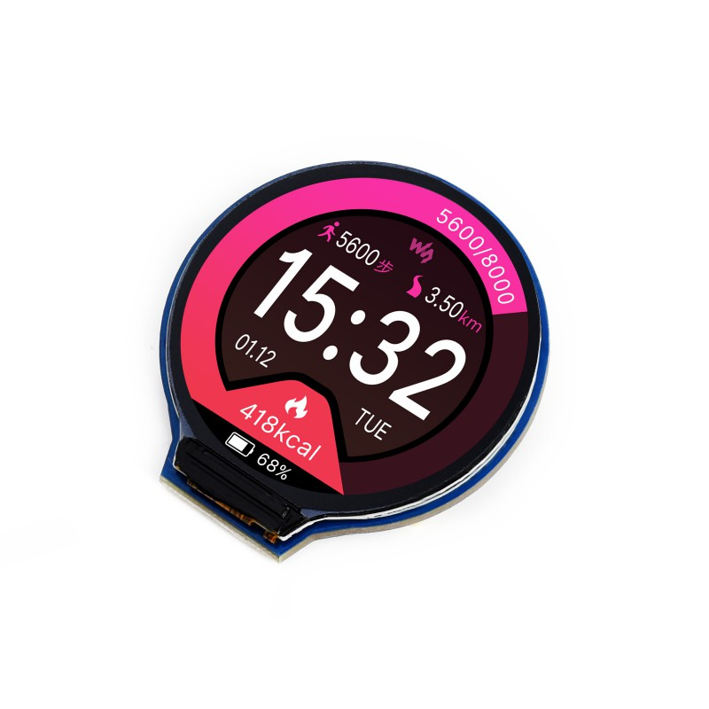
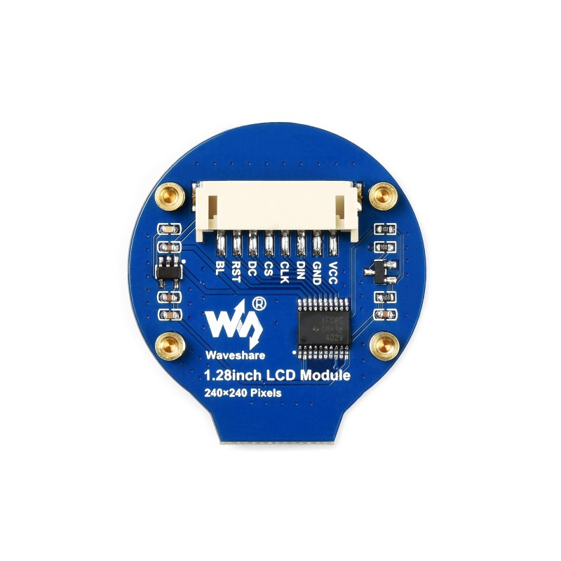

# javaBin badge

Uses a GC9A01A display and a Teensy 4.1 microcontrolle (since the 4.1 has a micro-SD card slot).

Displays different images on screen.

## Display

GC9A01A round display - I used this part from waveshare: https://www.waveshare.com/1.28inch-lcd-module.htm




## Teensy

The Teensy 4 version of the SD library is not compatible with the Adafruit_GFX image loader classes
so loading from bitmap on the SD card does not work out of the box.

Adafruit_GFX is expecting image data as rgb565 (16 bit number - 5 bits red, 6 bits green 5 bits blue).

## Image conversion/preparation

The java project in the `converter` directory will read a PNG and spit out a dat file of data in that format - a list of bytes that are really 16 bits in little endian order.

These can then be read from the SD card to a `uint16_t *` and passed to `drawRGBBitmap`.

### Image Conversion

- All images **MUST** be max of 240 pixels per side
- Default size is 170 pixel square
- Format - PNG
- Transparent pixels will be dropped (black pixel) - alpha is ignored.

### Build converter

```shell
cd converter
mvn clean install
```

### Convert images

```shell
cd images
for F in *png; do
    java -jar ../converter/target/converter-1.0-SNAPSHOT.jar $F ${F%%.png}.dat
done
```
